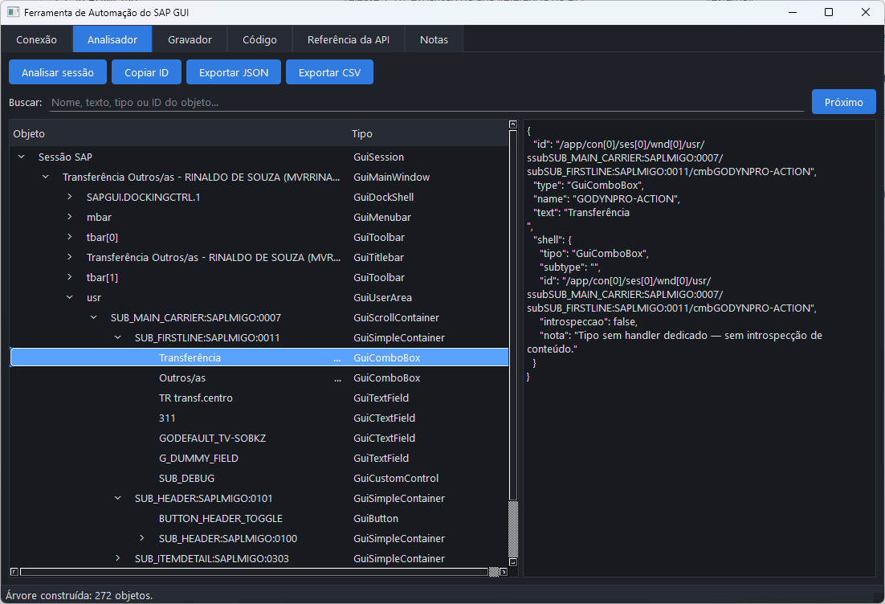

# SAP GUI Scripting Tool

## Referência do checkout — 2026-09-30

`pyproject.toml` declara 1.3.0, Python >=3.10 e dois entrypoints:
`sap-scripting-tool = src.main:main` (UI Qt) e
`sap-scripting-tool-cli = src.cli:main` (headless, ver seção "CLI headless"
abaixo). O analisador/gravador
é desktop Windows; Fiori e WebGUI pertencem ao projeto FIORI-AUTO. Os testes
usam fakes COM; `python -m pytest -m "not sap_live"` seleciona a validação
local sem sessão SAP. O metadado Homepage/Issues do pyproject ainda contém
URLs example; use o repositório do projeto indicado nesta página para suporte.

Esta revisão (2026-09-30) validou a CLI headless contra um SAP GUI real
(Project Builder/cProjects) — ver [CHANGELOG](CHANGELOG.md) para o histórico
completo e a seção "Limitações conhecidas" abaixo para o que foi descoberto
no processo.

[](CHANGELOG.md)
[](LICENSE)
[](pyproject.toml)
[](.github/workflows/ci.yml)

Esta é uma solução para Windows de **análise e gravação de SAP GUI Scripting**, desenvolvida como uma alternativa de código aberto em relação ao descontinuado *Scripting Tracker* (Stefan Schnell, 2024). Percorre a árvore de objetos de uma sessão SAP, grava interações do usuário e gera scripts de automação prontos em **seis linguagens**.



## O que faz de diferente do Scripting Tracker

O Scripting Tracker era cego para os controles modernos de SAP. Esta ferramenta
resolve exatamente as lacunas que ele nunca cobriu:

| Funcionalidade | Scripting Tracker | SAP GUI Scripting Tool |
| --- | :---: | :---: |
| Analisador de objetos SAP normais | ✅ | ✅ |
| Analisador de controles `GuiShell`/`GuiTree` | ❌ | ✅ Handler especializado |
| Gravador por eventos COM | ✅ | ✅ |
| Gravador de interações com `GuiShell` | ❌ | ✅ Polling por *snapshot* |
| Captura de diálogos Win32 nativos | ❌ | ✅ *Thread* `win32gui` + AutoItX |
| Código híbrido SAP + Win32 | ❌ | ✅ Intercalado automaticamente |
| Geração de código | ✅ VBA, Python, VBScript, PowerShell, AutoIt, Java | ✅ VBA, Python, VBScript, PowerShell, AutoIt, Java |
| Exportação da árvore | ✅ | ✅ JSON + CSV + área de transferência |
| Acesso headless (IA/automação) | ❌ | ✅ CLI `sap-scripting-tool-cli` (sem abrir a UI) |
| Código aberto | ❌ | ✅ Licença MIT |

## Pré-requisitos

- **Windows** com **SAP GUI for Windows** instalado (suporte a 64-bit / versão 8.00+).
- **SAP GUI Scripting habilitado** no servidor e no cliente
  (`Opções → Acessibilidade & Scripting → Scripting`).
- **Python 3.10+** (para rodar a partir do código-fonte).
- **AutoItX3** registrado (`AutoItX3.dll`) — necessário apenas para gravar e
  executar a automação de diálogos Win32 nativos.

> A ferramenta opera exclusivamente com o SAP GUI for Windows. Não há suporte a
> SAP Web GUI, SAP Fiori ou plataformas não-Windows.

## Instalação

### Opção A — A partir do código-fonte

```bash
git clone https://github.com/rinaldops/saptracker.git
cd saptracker

python -m venv .venv
.venv\Scripts\activate

pip install -e .
sap-scripting-tool
```

Para desenvolvimento (lint, tipos, testes, docs e empacotamento):

```bash
pip install -e ".[dev,docs,build]"
```

### Opção B — Executável standalone

Gere um executável que roda sem instalação de Python:

```bash
python scripts/build.py
```

O binário é produzido em `dist/SAPTracker.exe`. A arquitetura (x86/x64)
acompanha a do interpretador Python usado no build.

## Primeiros passos

1. **Abra o SAP GUI** e faça logon em uma sessão, com Scripting habilitado.
2. **Inicie a ferramenta** (`sap-scripting-tool` ou o `.exe`).
3. Na aba **Conexão**, clique em **Conectar / Atualizar sessões**. A primeira
   sessão é selecionada automaticamente e recebe o marcador **CONECTADO**;
   clique em outra sessão para trocar a conexão usada pela aplicação.
4. Na aba **Analisador**, clique em **Analisar sessão** (ou pressione **F5**).
   A barra de progresso acompanha os objetos processados. Use a busca para
   localizar por nome, texto, tipo ou ID e pressione **Próximo** para percorrer
   os resultados, expandindo automaticamente a hierarquia. Pressione o botão
   direito sobre uma linha para destacar o objeto no SAP; ao soltá-lo, a
   moldura desaparece. **Copiar ID** ou **Ctrl+C** envia o ID para a área de
   transferência.
5. Na aba **Gravador**, escolha a **linguagem** (VBA vem primeiro), clique em
   **Gravar** (**F9**), interaja com o SAP e clique em **Parar** (**Shift+F9**).
6. Clique em **Gerar código** — o script aparece na aba **Código**, pronto para
   **Copiar** ou **Salvar** com a extensão correta.

### Atalhos de teclado

| Atalho | Ação |
| --- | --- |
| `F5` | Atualizar a árvore de objetos |
| `F9` | Iniciar gravação |
| `Shift+F9` | Parar gravação |
| `Ctrl+C` | Copiar ID do objeto selecionado (aba Analisador) |

## Suporte a GuiShell

O grande diferencial da ferramenta. Cada tipo de `GuiShell` tem um handler
dedicado em [`src/core/shell_handlers/`](src/core/shell_handlers/) que faz a
introspecção do conteúdo interno e detecta mudanças para o Gravador:

| Tipo SAP | O que é inspecionado |
| --- | --- |
| `GuiGridView` (ALV Grid) | Colunas, linhas, valores de célula, célula atual, linhas selecionadas e primeira linha visível; aceita coleções COM e `SAFEARRAY` |
| `GuiTree` | Chaves de nós, texto por chave, hierarquia de filhos, colunas e *item text* |
| `GuiTextEdit` | Número de linhas, primeira linha visível, texto selecionado, conteúdo atual |
| `GuiCalendar` | Data de foco, intervalo de seleção, primeiro e último dia visível |
| `GuiToolbarControl` | Botões disponíveis, *tooltips* e estado de habilitação |
| *Demais tipos* | *Fallback* genérico: ID, tipo e *SubType* (sem introspecção de conteúdo) |

Como o SAP **não emite eventos COM para `GuiShell`** (*SAP Note 587202*), esses
controles são gravados por *polling* de *snapshots* em vez de *event listeners*.

## CLI headless (para IA/automação)

Além da interface Qt, `pyproject.toml` registra o script de console
`sap-scripting-tool-cli` — reaproveita 100% do `Analyser`/`SapConnection` já
usados pela UI, sem abrir nenhuma janela. Pensado para agentes de IA lerem o
estado da tela do SAP GUI como JSON estruturado em vez de captura de tela (ver
a skill [`sap-gui-snapshot`](../_skills/sap-gui-snapshot/SKILL.md), no
agregador `app-devs`).

| Comando | Faz | Efeitos colaterais |
| --- | --- | --- |
| `snapshot [--out ARQ] [--full-grids]` | Exporta a árvore de objetos em JSON | Nenhum (a menos que `--full-grids` recupere um grid incompleto) |
| `inspect ID` | Detalha um objeto (introspecção rica de `GuiShell`) | Nenhum |
| `highlight ID [--off]` | Desenha/remove a moldura vermelha (`Visualize`) | Visual, na tela |
| `select-node ID CHAVE` | Seleciona um nó de `GuiTree` (`SelectNode`) | Seleção/scroll, na tela |
| `select-row ID LINHA` | Seleciona uma linha de `GuiGridView` (`SetCurrentCell`/`SelectedRows`) | Seleção/scroll, na tela |
| `copy-table ID` | Copia a grade inteira de um `GuiGridView` via clipboard | Seleção na tela + clipboard (restaurado ao final) |

Para GuiTableControl, a análise normal captura somente as células vivas na viewport atual e os nomes das colunas. Ela não pagina a tabela. A captura completa é uma operação explícita documentada em [docs/gui-table-control-paginacao.md](docs/gui-table-control-paginacao.md).

Todos aceitam `--connection N --session N` (padrão `0`/`0`). Erros de conexão
saem com código `2` e mensagem no stderr.

## Geração de código

O Gravador converte as ações capturadas em scripts idiomáticos. Linguagens
suportadas (na ordem de exibição da UI):

| Linguagem | Identificador | Saída |
| --- | --- | --- |
| **VBA** (Excel/Access) | `vba` | `.bas` |
| Python (pywin32) | `python` | `.py` |
| VBScript | `vbscript` | `.vbs` |
| PowerShell | `powershell` | `.ps1` |
| AutoIt | `autoit` | `.au3` |
| Java (Jacob) | `java` | `.java` |

A mesma ação (*selecionar um nó em um `GuiTree`*) em três linguagens:

```vb
' VBA
session.FindById("wnd[0]/usr/cntlTREE1/shellcont/shell").SelectNode "000042"
```

```python
# Python
session.FindById("wnd[0]/usr/cntlTREE1/shellcont/shell").SelectNode("000042")
```

```powershell
# PowerShell
$session.FindById("wnd[0]/usr/cntlTREE1/shellcont/shell").SelectNode('000042')
```

Quando um **diálogo Win32 nativo** (ex.: *Salvar como*, `CLASS:#32770`) aparece
durante a gravação, um bloco AutoItX é **intercalado automaticamente** no script,
com o título e a classe da janela e *placeholders* para os valores dos campos.

## Limitações conhecidas

- **Alguns `GuiGridView` não expõem `GetColumnOrder`/`GetColumnNames` via
  Scripting** (ex.: o "worklist" do Project Builder/cProjects, hospedado num
  container) — só a coluna com foco atual (`CurrentCellColumn`) fica
  disponível por nome, mesmo que `ColumnCount` reporte muitas mais. É uma
  limitação da API do SAP GUI Scripting nesse tipo de grid, não do código
  desta ferramenta. Um nó `GuiGridColumnsAviso` sinaliza isso na árvore em vez
  de mascarar a lacuna; `snapshot --full-grids`/`copy-table` recuperam os
  dados completos via clipboard (`SelectAll` + menu de contexto → "Copiar"),
  contornando a ausência de nomes técnicos.
- **ALV Grids grandes carregam do servidor 1-2 "páginas" de linhas por vez.**
  Ler/copiar sem antes rolar o grid inteiro (`FirstVisibleRow`) deixa linhas
  além da primeira página vazias. `copy-table`/`snapshot --full-grids` já
  fazem esse aquecimento automaticamente; chamadas diretas a `GetCellValue`
  fora desses comandos não.
- **GuiTree só reporta nós já expandidos/carregados**
  (`GetAllNodeKeys()` é *lazy-load* — ver `tree.py`).
- A recuperação de grids incompletos (`full_grid_data=True`) é deliberadamente
  **desligada** no caminho de *polling* do Gravador (a cada ~250ms): rola a
  tela e usa o clipboard, o que degradaria a gravação ao vivo. Só as ações
  explícitas (`snapshot --full-grids`, "Analisar sessão" na UI, `copy-table`)
  a usam.

## Contribuição

PRs são bem-vindos. O CI (GitHub Actions) precisa passar em `ruff` (lint),
`mypy` (tipos) e `pytest` (testes); toda nova funcionalidade deve trazer
*docstrings* e uma entrada no [CHANGELOG.md](CHANGELOG.md).

### Adicionar um novo handler GuiShell

1. Crie `src/core/shell_handlers/<tipo>.py`.
2. Implemente uma classe herdando de `GuiShellHandler` com os três métodos:
   `inspecionar()`, `tirar_snapshot()` e `gerar_codigo()`.
3. Registre-o no dicionário `HANDLERS` em
   [`src/core/shell_handlers/__init__.py`](src/core/shell_handlers/__init__.py).
4. Escreva testes unitários em `tests/` usando *mocks* COM.

### Adicionar uma nova linguagem de geração

1. Crie `src/codegen/<linguagem>.py` herdando de `CodeGenerator`.
2. Registre a classe na tupla `_GENERATORS` em
   [`src/codegen/__init__.py`](src/codegen/__init__.py) — ela passa a aparecer
   automaticamente na lista da aba Gravador.
3. Escreva testes cobrindo as ações principais (`set_text`, `press`,
   `select_node`, etc.).

Mais detalhes de arquitetura em [docs/architecture.md](docs/architecture.md).

## Exportação da YSREGRASPEP

A transação `ysregraspep` não possui exportação da tabela para Excel. Com o SAP GUI aberto e a sessão posicionada na transação, execute:

```bash
python scripts/export_ysregraspep.py --out dados-ysregraspep.xlsx
```

O script reutiliza o capturador paginado de `GuiTableControl`, percorre todas as páginas (22 linhas por página no caso validado), e grava as linhas em uma planilha Excel com filtro e cabeçalho congelado. Para outra conexão/sessão:

```bash
python scripts/export_ysregraspep.py --connection 1 --session 0 --out dados.xlsx
```

O ID da tabela pode ser substituído com `--table-id`. A dependência de saída é `openpyxl` (`python -m pip install openpyxl`). O processo reposiciona a tabela no SAP durante a captura; execute-o somente quando essa alteração visual for aceitável.
## Licença

Distribuído sob a licença [MIT](LICENSE).
